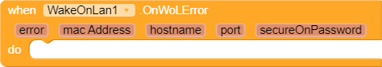
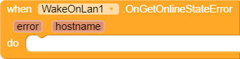

# WakeOnLan

A Wake-on-Lan Extension for App Inventor 2 and its distros.
Inspired by [Simple Java Implementation of Wake-on-LAN](http://www.jibble.org/wake-on-lan/)

# Block Description
Blocks | Details | Parameters
--- | --- | ---
 | Raised when magic packet is sent with WakeOnLanAsync method. | <ul><li>`String macAddress`: mac address of the host</li><li>`String hostname`: hostname or the ip address of the host</li><li>`int port`: the target port</li><li>`String secureOnPassword`: the SecureOn password that was sent</li></ul>
 | Raised when error occurred during WakeOnLanAsync. | <ul><li>`String error`: error message</li><li>`String macAddress`: mac address of the host</li><li>`String hostname`: hostname or the ip address of the host</li><li>`int port`: the target port</li><li>`String secureOnPassword`: the SecureOn password that was sent</li></ul>
 | Raised when online state is found. | <ul><li>`boolean online`: true if the host is online</li><li>`String hostname`: hostname or the ip address</li></ul>
 | Raised when error occurred during GetOnlineState. | <ul><li>`String error`: error message</li><li>`String hostname`: hostname or the ip address</li></ul>
 | Wake On Lan asynchronously. | <li>`String macAddress`: mac address of the host. The format could either be `XX:XX:XX:XX:XX:XX` or `XX-XX-XX-XX-XX-XX`</li><li>`String hostname`: hostname or the ip address of the host</li><li>`int port`: the target port (NOTE: commonly 9)</li><li>`String secureOnPassword` (optional): the SecureOn password. The format could either be `XX:XX:XX:XX:XX:XX` or `XX-XX-XX-XX-XX-XX`. No SecureOn password will be sent to the host if an `empty string` is passed.</li></ul>
 | Check if device is online (or awake). *Note that this method no guarantee.* | <ul><li>`String hostname`: hostname or the ip address</li><li>`int timout`: timeout in milliseconds (ms)</li></ul>

# Building
1. Install [rush-cli](https://github.com/ShreyashSaitwal/rush-cli)
2. Clone this repository with `git clone`
3. Execute `rush build` or `rush build -o` in root directory of this repo (JDK 8 or lower).

# Change log
* `v1.0.0` (<time datetime="2022-05-24">`24/05/2022`</time>):  First release